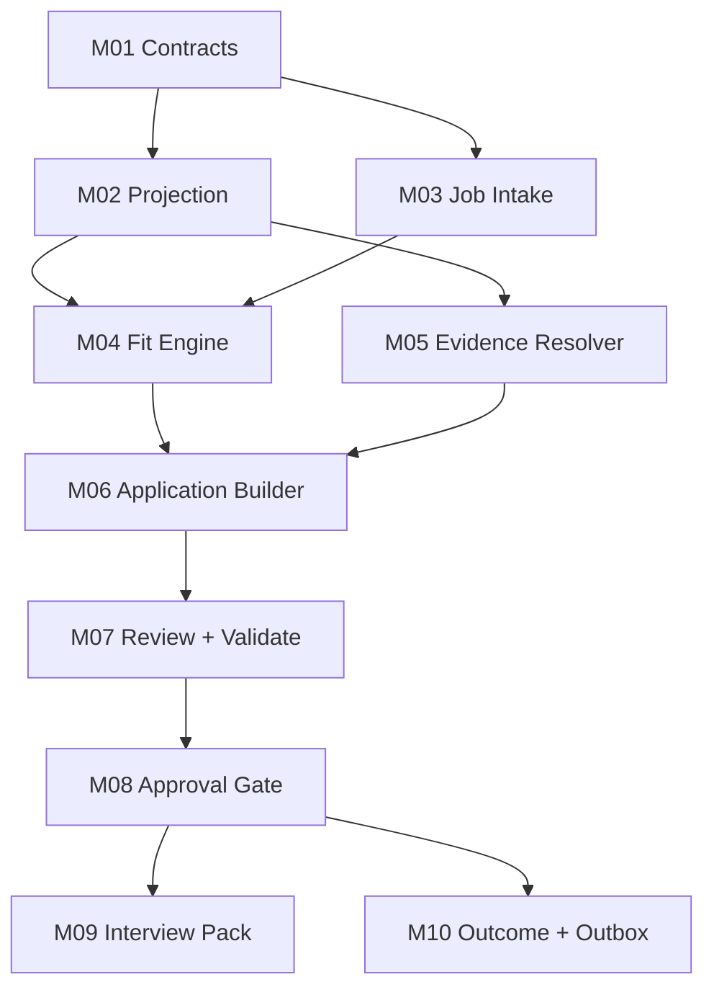

# SPEC.md

<!-- chunk_id: CAR-AIJS-EXEC.A2.001 | title: SPEC Module Graph | summary: Defines the module dependency graph, MVP build order, shared interfaces, and implementation constraints. | tags: [spec, modules, build-order] | entities: [Projection, Intake, Fit, Evidence, Application] | confidence: 99 -->

## Implementation Objective

Build a private, deterministic execution runtime that consumes a CAR projection and a job posting, emits a 3D decision and evidence-backed application/interview artifacts, validates them, and creates idempotent outcome events. The runtime must remain replaceable and must never become the canonical source for career facts.

**VIZ-06 — Modules build from contracts and projection toward gated artifacts and an idempotent event outbox.**

*Alt-text: Shared contracts precede projection and intake; evidence and fit converge on artifact generation before approval, interview, and outcomes.*

### Numbered MVP Build Order

| Order | Module | Priority | Why now |
|---:|---|---:|---|
| 1 | M01 Contracts | P0 | All later behavior depends on shared types |
| 2 | M02 Projection | P0 | Establishes authority direction and evidence IDs |
| 3 | M03 Job Intake | P0 | Creates one sanitized job object |
| 4 | M04 Fit Engine | P0 | Stops bad-fit work before generation |
| 5 | M05 Evidence Resolver | P0 | Prevents unsupported candidate claims |
| 6 | M06 Application Builder | P0 | Produces primary deliverable |
| 7 | M07 Review + Validate | P0 | Converts drafts into releasable artifacts |
| 8 | M08 Approval Gate | P0 | Preserves human authority |
| 9 | M10 Outcome + Outbox | P0 | Makes execution observable and learnable |
| 10 | M09 Interview Pack | P1 | Adds post-application stage continuity |

<!-- chunk_id: CAR-AIJS-EXEC.A2.002 | title: M01 Contracts | summary: Defines the single shared schema and enum authority used by every runtime module. | tags: [contracts, schema] | entities: [JobPosting, FitAssessment, OutcomeEvent] | confidence: 99 -->

## M01 Contracts

**Purpose.** Define one shared data contract so modules cannot silently diverge on field names, enums, nullability, or evidence states.

| API contract | Specification |
|---|---|
| Input | JSON Schema files and Python dataclass definitions |
| Output | Validated typed entities: `RuntimeProjection`, `JobPosting`, `FitAssessment`, `EvidenceClaim`, `ApplicationPackage`, `ReviewFinding`, `InterviewPack`, `OutcomeEvent` |
| Error states | `SchemaViolation`, `UnknownEnum`, `DuplicateIdentifier`, `UnsupportedVersion` |
| State | Pure definitions; no persistence |
| Data model | Stable IDs, explicit `unknown`/null state, confidence 0–100, evidence ID arrays |

| Acceptance boolean | Test |
|---|---|
| `contracts_have_single_enum_authority == true` | No duplicate status/verdict enum definitions |
| `unknown_is_explicit == true` | Missing evidence cannot deserialize as optimistic false/zero |
| `schemas_round_trip == true` | Serialize → validate → deserialize retains semantic value |
| `invalid_version_fails == true` | Unsupported contract version raises typed error |

**Edges/errors.** Reject duplicated IDs, unknown future enum values unless explicitly configured for forward compatibility, and any score outside 0–100. Do not auto-migrate silently.

<!-- chunk_id: CAR-AIJS-EXEC.A2.003 | title: M02 Projection | summary: Builds a deterministic minimum-necessary runtime context from canonical CAR exports without assuming canonical write authority. | tags: [projection, evidence, determinism] | entities: [RuntimeProjection, CanonicalArtifact] | confidence: 99 -->

## M02 Projection

**Purpose.** Produce a reproducible, minimal context bundle from CAR exports so Claude can work without loading or owning the full career corpus.

| API contract | Specification |
|---|---|
| Input | Canonical CAR export containing artifact IDs, versions, claims, evidence IDs, skills, STARs, approved resume/copy modules, constraints |
| Output | `RuntimeProjection` JSON + SHA-256 checksum + source-version manifest |
| Error states | `MissingRequiredArtifact`, `DuplicateEvidenceId`, `ConflictingCanonicalClaim`, `ProjectionDrift` |
| State | Output is generated/replaceable; never hand-edited |
| Data model | projection_id, generated_at, source_versions, evidence_claims, role_targets, constraints, approved_modules, checksum |

| Acceptance boolean | Test |
|---|---|
| `same_input_same_projection == true` | Repeated normalized builds have identical checksum |
| `projection_has_source_versions == true` | Every admitted artifact has version metadata |
| `candidate_claims_have_evidence == true` | Factual candidate claims contain ≥1 evidence ID or explicit unverified state |
| `projection_is_noncanonical == true` | Runtime write APIs expose no CAR mutation method |

**Edges/errors.** On conflicting canonical claims, fail and emit a verification item instead of selecting the newest or highest number. Sort arrays deterministically before hashing.

<!-- chunk_id: CAR-AIJS-EXEC.A2.004 | title: M03 Job Intake | summary: Normalizes untrusted posting text into one inert data object while preventing posting-supplied instructions from entering agent policy. | tags: [job-intake, prompt-injection] | entities: [JobPosting] | confidence: 99 -->

## M03 Job Intake

**Purpose.** Convert pasted or fetched job content into a normalized inert record without allowing the posting to control tools or policy.

| API contract | Specification |
|---|---|
| Input | Raw JD text plus optional source URL and capture timestamp |
| Output | `JobPosting` with company, role, location, work mode, compensation text, requirements, responsibilities, source metadata |
| Error states | `EmptyPosting`, `FetchDenied`, `UntrustedDirectiveDetected`, `NormalizationIncomplete` |
| State | Immutable captured posting snapshot |
| Data model | job_id, source_url, captured_at, raw_text_hash, extracted_fields, unresolved_fields |

| Acceptance boolean | Test |
|---|---|
| `posting_is_data_only == true` | Embedded “run/fetch/read/send” instructions never invoke tools |
| `raw_snapshot_hash_present == true` | Every posting stores a content hash |
| `missing_fields_are_null == true` | No invented salary, location, eligibility, or requirement |
| `same_text_same_job_hash == true` | Normalization is stable for identical content |

**Edges/errors.** If a URL cannot be safely fetched, require pasted text. Never follow links found inside the posting body. Company research starts from the confirmed company identity, not posting-supplied URLs.

<!-- chunk_id: CAR-AIJS-EXEC.A2.005 | title: M04 Fit Engine | summary: Runs hard vetoes and the career project's three-dimensional fit decision before any application material is generated. | tags: [fit, scoring, gates] | entities: [FitAssessment] | confidence: 99 -->

## M04 Fit Engine

**Purpose.** Decide whether the opportunity deserves effort before generating application materials.

| API contract | Specification |
|---|---|
| Input | `RuntimeProjection`, `JobPosting` |
| Output | `FitAssessment` with hard gates, Job-Fit Match, Requirements Reality, Strategic Value, evidence confidence, verdict |
| Error states | `GateEvidenceMissing`, `AssessmentIncomplete`, `ScoreOutOfRange` |
| State | Immutable assessment versioned by posting hash + projection checksum |
| Data model | gate_results[], job_fit, requirements_reality, strategic_value, overall_fit, confidence, verdict, evidence_refs[] |

| Condition | Verdict |
|---|---|
| Any configured hard gate fails | PASS |
| Overall fit <70 | PASS unless explicit human override |
| Overall fit ≥70 but a material requirement gap exists | CONSIDER |
| Overall fit ≥70 and no material requirement gap | ACT |
| Critical evidence confidence <80 | CONSIDER or block finalization |

| Acceptance boolean | Test |
|---|---|
| `hard_gate_overrides_score == true` | 99 fit + failed hard gate still PASS |
| `three_dimensions_present == true` | Every non-gated assessment emits all 3 dimensions |
| `requirements_link_to_evidence == true` | Claimed qualification maps to evidence IDs |
| `below_70_does_not_auto_build == true` | Builder is not called without human override |

**Edges/errors.** Do not score missing requirements as satisfied. Separate external research evidence from inference.

<!-- chunk_id: CAR-AIJS-EXEC.A2.006 | title: M05 Evidence Resolver | summary: Enforces a zero-fabrication candidate-claim contract by resolving every factual claim to admitted evidence. | tags: [evidence, zero-fabrication] | entities: [EvidenceClaim] | confidence: 99 -->

## M05 Evidence Resolver

**Purpose.** Make unsupported candidate facts mechanically blocking rather than dependent on reviewer memory.

| API contract | Specification |
|---|---|
| Input | Candidate claim text or structured claim candidate + `RuntimeProjection` |
| Output | `EvidenceClaim` with evidence IDs, confidence, status `verified|unverified|rejected` |
| Error states | `NoEvidence`, `ConflictingEvidence`, `EvidenceBelowThreshold` |
| State | Read-only against projection |
| Data model | claim_id, normalized_claim, evidence_ids[], confidence, status, source_versions[] |

| Acceptance boolean | Test |
|---|---|
| `unsupported_factual_claims_block == true` | No evidence produces rejected/unverified, never verified |
| `metric_strengthening_fails == true` | “30%” evidence cannot become “35%” |
| `claim_provenance_is_complete == true` | Verified claim contains evidence IDs + source versions |
| `conflict_requires_review == true` | Contradictory evidence cannot auto-resolve |

**Edges/errors.** Derived narrative language may compress evidence but may not change magnitude, ownership, dates, title, certification, authorization, team size, or causal attribution.

<!-- chunk_id: CAR-AIJS-EXEC.A2.007 | title: M06 Application Builder | summary: Composes role-specific application artifacts only from approved modules and evidence-resolved claims. | tags: [application, resume, cover-letter] | entities: [ApplicationPackage] | confidence: 98 -->

## M06 Application Builder

**Purpose.** Assemble a tailored application package while preserving approved wording, JD terminology, and evidence integrity.

| API contract | Specification |
|---|---|
| Input | `FitAssessment` with ACT/approved override, `RuntimeProjection`, `JobPosting`, verified `EvidenceClaim` set |
| Output | Versioned `ApplicationPackage` containing resume Markdown, application-copy Markdown, claim ledger, source manifest |
| Error states | `FitGateClosed`, `UnsupportedClaim`, `MissingRequiredModule`, `PackageTooLong` |
| State | Draft versions are immutable snapshots |
| Data model | package_id, job_id, version, artifacts[], claims[], keywords[], source_manifest, checksum |

| Acceptance boolean | Test |
|---|---|
| `jd_terms_are_source_backed == true` | Job-specific terminology comes from captured posting |
| `candidate_facts_are_evidence_backed == true` | Every factual candidate claim is verified |
| `three_specific_achievements_present == true` | Application copy contains role-relevant proof when source supports it |
| `company_name_is_exact == true` | Company and role resolve to normalized posting |
| `package_version_is_immutable == true` | Revision creates version N+1 |

**Edges/errors.** If no truthful proof exists for a requirement, state the gap or omit the claim. Never synthesize a credential, years-of-experience total, or metric to improve fit.

<!-- chunk_id: CAR-AIJS-EXEC.A2.008 | title: M07 Review and Validation | summary: Separates draft generation from release by running independent policy, evidence, schema, and ATS-readability gates. | tags: [review, validation, ats] | entities: [ReviewFinding, ApplicationPackage] | confidence: 99 -->

## M07 Review + Validate

**Purpose.** Convert a draft into a release candidate through independent criticism and deterministic validators.

| API contract | Specification |
|---|---|
| Input | `ApplicationPackage`, posting, assessment, projection |
| Output | `ReviewFinding[]`, validation report, release-candidate package or blocked state |
| Error states | `BlockingFinding`, `SchemaFailure`, `ATSUnreadable`, `PolicyViolation` |
| State | Findings append to package review history |
| Data model | rule_id, severity, finding_status, artifact_ref, message, evidence_refs[] |

| Validator | Pass bar |
|---|---|
| Evidence | 0 unsupported factual candidate claims |
| Schema | 100% contract-valid artifacts |
| ATS/text | Extractable text on 100% golden outputs |
| JD alignment | Required terminology mapped without keyword stuffing |
| Policy | No forbidden external action or runtime-canonical mutation |
| Reviewer | No unresolved blocking finding |

| Acceptance boolean | Test |
|---|---|
| `draft_and_review_are_separate == true` | Reviewer does not reuse draft verdict blindly |
| `blocking_findings_stop_release == true` | Release candidate absent when blocker open |
| `ats_fixture_suite_passes == true` | All golden outputs meet extraction threshold |
| `adversarial_posting_suite_passes == true` | Posting directives cannot cross tool/policy boundary |

<!-- chunk_id: CAR-AIJS-EXEC.A2.009 | title: M08 Approval Gate | summary: Creates the explicit human authority boundary before any external or canonical mutation can occur. | tags: [approval, safety] | entities: [ApplicationPackage] | confidence: 99 -->

## M08 Approval Gate

**Purpose.** Require a fresh explicit human decision after review and before any irreversible boundary.

| API contract | Specification |
|---|---|
| Input | Release-candidate package checksum + requested action |
| Output | Approval record bound to checksum/action or denial |
| Error states | `ApprovalMissing`, `ApprovalStale`, `ChecksumChanged`, `ActionMismatch` |
| State | Append-only approval record |
| Data model | approval_id, package_checksum, action, approved_at, approver, expires_at/null |

| Acceptance boolean | Test |
|---|---|
| `approval_is_checksum_bound == true` | Edited package invalidates approval |
| `approval_is_action_bound == true` | Approval to archive does not authorize send |
| `external_action_without_approval_fails == true` | Boundary API returns typed failure |
| `runtime_canonical_write_without_approval_fails == true` | CAR mutation path does not exist or is blocked |

<!-- chunk_id: CAR-AIJS-EXEC.A2.010 | title: M09 Interview Pack | summary: Builds stage-specific interview preparation from the exact submitted application and CAR evidence, never generic recollection. | tags: [interview, star] | entities: [InterviewPack] | confidence: 98 -->

## M09 Interview Pack

**Purpose.** Generate interview preparation anchored to the exact posting and exact package the interviewer received.

| API contract | Specification |
|---|---|
| Input | Approved/submitted `ApplicationPackage`, stage, posting, runtime projection, prior interview notes when present |
| Output | `InterviewPack` with likely questions, STAR mappings, evidence IDs, gaps, questions for interviewer |
| Error states | `PackageNotFound`, `StageUnknown`, `EvidenceGap` |
| State | One immutable pack per application version + interview stage |
| Data model | interview_id, package_id, stage, questions[], answer_maps[], evidence_ids[], gap_bridges[] |

| Acceptance boolean | Test |
|---|---|
| `exact_package_is_referenced == true` | Interview pack names package ID/checksum |
| `answers_are_evidence_mapped == true` | Factual answers have evidence IDs |
| `gaps_are_explicit == true` | Missing experience uses bridge language, not invention |
| `prior_stage_feedback_is_versioned == true` | New stage reads but does not overwrite prior pack |

<!-- chunk_id: CAR-AIJS-EXEC.A2.011 | title: M10 Outcome and Outbox | summary: Persists idempotent outcome events and exports a deterministic outbox for n8n, Linear, and Notion routing. | tags: [events, idempotency, n8n] | entities: [OutcomeEvent] | confidence: 99 -->

## M10 Outcome + Outbox

**Purpose.** Convert application lifecycle changes into replay-safe events without giving integrations authority over career facts.

| API contract | Specification |
|---|---|
| Input | Approved package ID, outcome type, source, occurred_at, optional evidence reference |
| Output | `OutcomeEvent` plus outbox record for n8n |
| Error states | `DuplicateEvent`, `InvalidTransition`, `UnknownPackage`, `OutboxWriteFailure` |
| State | Append-only local/private event ledger |
| Data model | event_id UUID, package_id, type, occurred_at, source, idempotency_key, payload_version |

| Acceptance boolean | Test |
|---|---|
| `replay_creates_zero_duplicates == true` | Same idempotency key is a no-op |
| `invalid_transition_is_visible == true` | Conflict is quarantined, not guessed |
| `outbox_is_replayable == true` | Failed n8n delivery can retry same event |
| `integration_payload_has_no_secrets == true` | Schema rejects credential fields |

**Edges/errors.** n8n may update Linear/Notion operational records from accepted event payloads but may not mutate evidence claims, employment history, metrics, credentials, or canonical role data.

### Shared Interfaces and Event Contracts

| Interface | Producer | Consumer | Contract |
|---|---|---|---|
| RuntimeProjection v1 | M02 | M04/M05/M06/M09 | Immutable checksum + source versions |
| JobPosting v1 | M03 | M04/M06/M07 | Raw hash + normalized fields |
| FitAssessment v1 | M04 | M06/M07 | 3 dimensions + hard gates + confidence |
| EvidenceClaim v1 | M05 | M06/M07/M09 | Verified/unverified/rejected state |
| ApplicationPackage v1 | M06 | M07/M08/M09/M10 | Version + checksum + claim ledger |
| ApprovalRecord v1 | M08 | External boundary/M10 | Checksum-bound action grant |
| OutcomeEvent v1 | M10 | n8n | UUID + idempotency key + versioned payload |
