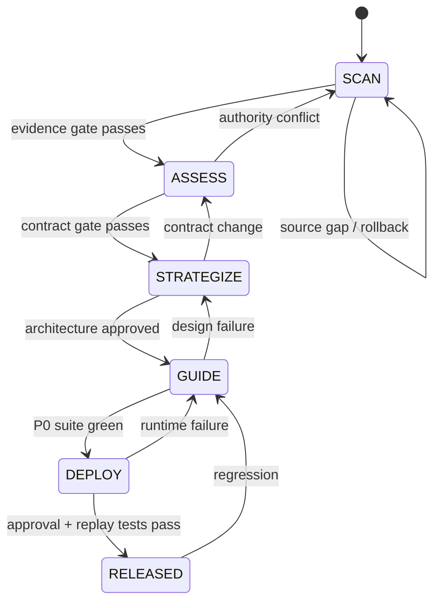
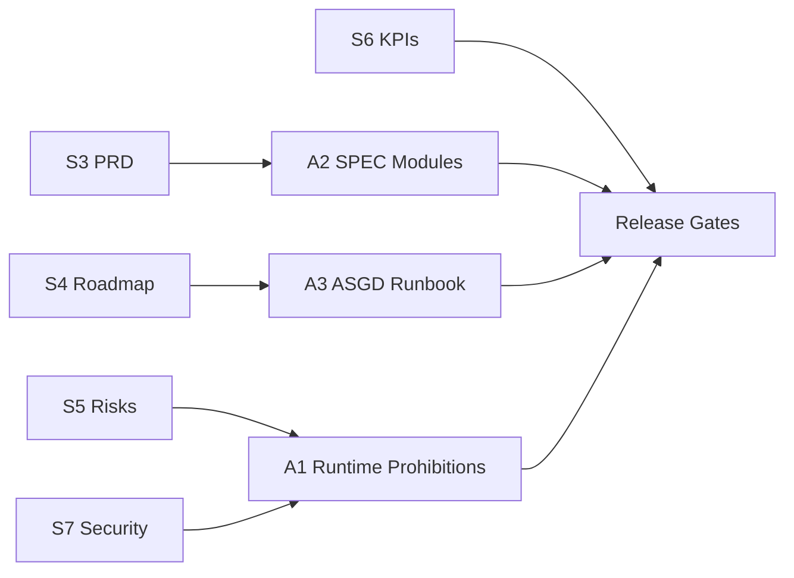

# RUNBOOK.md

<!-- chunk_id: CAR-AIJS-EXEC.A3.001 | title: Runbook Operating Model | summary: Defines ASGD execution order, context management, handoff mechanics, validation philosophy, and rollback discipline. | tags: [runbook, asgd, sessions] | entities: [Claude Code, Git] | confidence: 99 -->

## Operating Rule

Execute **SCAN → ASSESS → STRATEGIZE → GUIDE → DEPLOY** in order. Every phase writes durable state to Git before a new session, and every phase can roll back to its last green commit. Do not solve later-phase problems by weakening an earlier contract.

**VIZ-07 — Each phase advances only through a validation gate and rolls back to the last green checkpoint.**



*Alt-text: ASGD advances through explicit gates; failures return to the earliest phase whose assumption or implementation is invalid.*

### Session Operations

| Situation | Action | Why |
|---|---|---|
| Same focused module, context still coherent | Continue current session | Keeps local reasoning continuity |
| Context is noisy but current plan still valid | `/compact` | Retains session summary while reducing clutter |
| Phase boundary reached and state is committed | Start a fresh Claude Code session | Fresh discovery from files reduces stale conversational assumptions |
| Wrong architecture or stale assumptions dominate | `/clear`, then reread strategy/SPEC/progress | Prevents compaction from preserving bad framing |
| Long task nearing context limit | Commit green work and write `docs/progress.md` before compact/fresh session | Files + Git become durable state |
| Handoff to new session | Write plan/state to `docs/progress.md`, commit, start new session, reference that file | Makes handoff deterministic |

### Handoff Contract

A phase handoff is complete only when `docs/progress.md` records current phase, completed modules, failing tests, open decisions, last green commit, next exact task, and commands already run.

<!-- chunk_id: CAR-AIJS-EXEC.A3.002 | title: SCAN Phase | summary: Pins sources and authority boundaries before Claude changes code, preventing implementation against stale or ambiguous evidence. | tags: [scan, evidence, prompt] | entities: [CAR, GitHub] | confidence: 99 -->

## Phase 1 — SCAN

**Objective.** Freeze the implementation evidence boundary before creating or changing runtime code.

### Exact Claude Code Prompt

````text
You are executing Phase 1 SCAN for the CAR AI Job Search Integration.

Read strategy-car-ai-job-search-integration.md, SPEC.md if present, the repository tree, git status, git log -10 --oneline, and every existing policy/schema file before proposing changes.

Produce docs/source-manifest.md containing:
1. current repository visibility and default branch,
2. current commit SHA,
3. upstream reference MadsLorentzen/ai-job-search at commit 4c38f7ce4c73448e8158d78dfbed47562690cd5c,
4. CAR source artifacts admitted for runtime projection,
5. exact authority boundary: CAR=career truth, GitHub=code/tests, Linear=execution, n8n=routing, Notion=view/enrichment,
6. all unresolved source or contract gaps tagged UNKNOWN,
7. zero implementation changes.

Run no destructive or external actions. Do not infer missing CAR fields. Stop with NO-GO if authority is ambiguous.
````

| Validation gate | Pass bar |
|---|---|
| Source manifest exists | 100% required surfaces listed |
| Repository visibility | Private |
| Authority conflicts | 0 unresolved |
| Unverified P0 source dependency | 0 silently assumed |
| Git status | Clean or changes explained |

**Rollback.** Delete only the uncommitted manifest draft if incorrect. Do not change code in SCAN.

**Tests.** `git status --short`, repository visibility inspection, source-manifest lint.  
**Phase pass bar.** 100% of P0 inputs have a named source or explicit UNKNOWN with owner/action.

<!-- chunk_id: CAR-AIJS-EXEC.A3.003 | title: ASSESS Phase | summary: Builds shared contracts, threat fixtures, and failure tests before feature implementation. | tags: [assess, contracts, tests] | entities: [JSON Schema, OutcomeEvent] | confidence: 99 -->

## Phase 2 — ASSESS

**Objective.** Convert strategy into executable contracts and failure-first tests before implementing business logic.

### Exact Claude Code Prompt

````text
Execute Phase 2 ASSESS only.

Read strategy-car-ai-job-search-integration.md, docs/source-manifest.md, and SPEC.md.
Implement M01 Contracts before any other module.

Create the shared Python dataclasses and JSON Schemas for RuntimeProjection, JobPosting, FitAssessment, EvidenceClaim, ApplicationPackage, ReviewFinding, ApprovalRecord, InterviewPack, and OutcomeEvent.
Create contract tests that prove:
- unknown values stay explicit,
- scores outside 0-100 fail,
- duplicate IDs fail,
- unsupported versions fail,
- outcome idempotency keys are required,
- evidence IDs are required for verified candidate claims.

Add adversarial fixtures containing job-posting text that instructs the agent to fetch URLs, read files, reveal private data, or send information. The fixtures are inert test data.

Do not implement application generation yet. Run the complete contract suite and commit only if green.
````

| Validation gate | Pass bar |
|---|---|
| P0 entity schemas | 100% present |
| Enum authorities | Exactly one definition per shared enum |
| Invalid fixture rejection | 100% |
| Adversarial fixture storage | Inert data only |
| Test suite | 100% green |

**Rollback.** Revert to SCAN green commit if contracts require a source-authority change.  
**Tests.** Contract round trips, boundary ranges, enum drift, duplicate IDs, adversarial fixture parse.  
**Phase pass bar.** Contracts are stable enough that downstream modules need no private field copies.

<!-- chunk_id: CAR-AIJS-EXEC.A3.004 | title: STRATEGIZE Phase | summary: Locks build order, module interfaces, and irreversible-action boundaries before feature implementation. | tags: [strategize, architecture] | entities: [SPEC.md, CLAUDE.md] | confidence: 99 -->

## Phase 3 — STRATEGIZE

**Objective.** Lock the minimum module graph, CLI surface, and safety boundaries so implementation does not overengineer.

### Exact Claude Code Prompt

````text
Execute Phase 3 STRATEGIZE.

Read CLAUDE.md, SPEC.md, all M01 contracts, and the passing tests.
Do not add implementation features.

Verify the module graph has one directional path:
CAR export -> projection -> fit/evidence -> build -> review/validate -> approval -> outcome/outbox.

For each module M02-M10, confirm:
- exact input/output contract,
- no duplicated shared enums,
- no CAR canonical write API,
- no external-send API before ApprovalRecord,
- deterministic or append-only state behavior,
- one focused test plan.

Create docs/progress.md with the numbered build order and the first failing acceptance test to implement for M02.
If you find a contract gap, change M01 and tests now rather than hiding the gap in a module.
Commit the architecture lock.
````

| Validation gate | Pass bar |
|---|---|
| Directionality | No runtime → CAR canonical mutation path |
| External action | No send/mutation API reachable without approval |
| Module interfaces | 100% typed |
| Build order | Matches SPEC M01→M10 dependency graph |
| Open architecture decisions | 0 P0 blockers |

**Rollback.** Revert architecture lock and return to ASSESS when a schema change is required.  
**Tests.** Static import graph check, prohibited API/phrase lint, schema-reference lint.  
**Phase pass bar.** Architecture can be implemented module-by-module without inventing new cross-cutting state.

<!-- chunk_id: CAR-AIJS-EXEC.A3.005 | title: GUIDE Phase | summary: Implements P0 modules in dependency order with tests first, adversarial validation, and a green checkpoint after every focused module. | tags: [guide, implementation, tdd] | entities: [Projection, Fit, Evidence, ApplicationPackage] | confidence: 99 -->

## Phase 4 — GUIDE

**Objective.** Implement P0 runtime behavior in dependency order while keeping every module independently testable and rollback-safe.

### Exact Claude Code Prompt

````text
Execute Phase 4 GUIDE as a sequence of focused module loops.

For the next not-green P0 module in SPEC.md:
1. read only its contract, dependencies, existing tests, and relevant source files,
2. write or confirm failing acceptance tests before changing implementation,
3. implement the smallest general solution that satisfies the contract,
4. run focused tests,
5. run the complete P0 suite,
6. inspect git diff for unrelated changes,
7. commit the module only when both focused and full suites are green,
8. update docs/progress.md with test results and next module.

Implement in this order:
M02 Projection,
M03 Job Intake,
M04 Fit Engine,
M05 Evidence Resolver,
M06 Application Builder,
M07 Review + Validate,
M08 Approval Gate,
M10 Outcome + Outbox.

Do not implement M09 Interview Pack until P0 is green.
Do not weaken a test to make code pass. If a test conflicts with SPEC, stop and return to STRATEGIZE with the exact conflict.
````

| P0 test family | Pass bar |
|---|---:|
| Projection determinism | 100% |
| Untrusted-posting adversarial suite | 100% |
| Hard-gate override tests | 100% |
| 3D assessment completeness | 100% |
| Unsupported candidate claim blockers | 100% |
| Application golden fixtures | 100% |
| ATS/text extraction fixtures | 100% |
| Approval boundary tests | 100% |
| Outcome replay/idempotency | 100% |
| Complete P0 suite | 100% |

**Rollback.** Revert only the current module commit when a local implementation is defective. Return to STRATEGIZE if the defect exposes a contract/design error.  
**Phase pass bar.** All P0 acceptance booleans are true and `python3 -m car_job_search validate --all` exits 0.

<!-- chunk_id: CAR-AIJS-EXEC.A3.006 | title: DEPLOY Phase | summary: Packages a private release, runs final security and idempotency gates, and introduces n8n routing without widening system authority. | tags: [deploy, release, n8n] | entities: [GitHub Actions, n8n, Linear] | confidence: 98 -->

## Phase 5 — DEPLOY

**Objective.** Promote the green P0 runtime into controlled use without adding an untested external-action path.

### Exact Claude Code Prompt

````text
Execute Phase 5 DEPLOY.

Read CLAUDE.md, SPEC.md, docs/progress.md, the full test output, and the current git diff.
Do not add new P0 behavior.

1. Create or harden GitHub CI with least GITHUB_TOKEN permissions and full-SHA pins for third-party Actions.
2. Add a release command that emits dist/release-manifest.json with commit SHA, schema versions, test summary, projection contract version, and known limitations.
3. Add the versioned n8n workflow export or event-ingress contract under automation/ with credential stubs only.
4. Prove the same OutcomeEvent can be delivered twice without creating duplicate downstream work.
5. Run one dry-run application package against a golden JD. Do not send or submit it.
6. Require a checksum-bound human approval record to transition the package to approved.
7. Record launch evidence in docs/progress.md.

If any external action can occur without fresh approval, mark NO-GO and stop.
````

| Validation gate | Pass bar |
|---|---|
| GitHub repository | Private |
| GitHub Actions permissions | Minimum necessary |
| Third-party Actions | Full commit SHA pinned |
| Complete test suite | 100% green |
| Unsupported candidate claims | 0 |
| Dry-run external sends | 0 |
| Approval bypass paths | 0 |
| Outcome replay duplicates | 0 |
| Release manifest | Present and schema-valid |

**Rollback.** Disable n8n trigger, return to previous release tag/green commit, preserve append-only event log, regenerate runtime projection if corruption is suspected.  
**Tests.** Full suite, release-manifest schema, CI policy lint, event replay, n8n failure/quarantine simulation, approval-staleness test.  
**Phase pass bar.** Strategy North Star inputs are mechanically satisfied and VARR is measurable; production use remains human-approved.

## Post-Launch Module — M09 Interview Pack

<!-- chunk_id: CAR-AIJS-EXEC.A3.007 | title: Interview Extension | summary: Adds the post-launch interview module only after the application runtime and archive contracts are stable. | tags: [interview, extension] | entities: [InterviewPack] | confidence: 98 -->

### Exact Claude Code Prompt

````text
Implement M09 Interview Pack only after P0 release is green.

Use the exact approved/submitted ApplicationPackage ID and checksum, captured JobPosting, RuntimeProjection evidence IDs, and any prior stage notes.
Generate stage-specific likely questions, mapped STAR/evidence answers, explicit evidence gaps, and candidate questions.
Never substitute a newer resume or generic career summary for the exact package the interviewer received.
Add tests proving package checksum binding, evidence-linked answers, gap language, and preservation of prior-stage packs.
````

| Validation gate | Pass bar |
|---|---|
| Exact package reference | 100% |
| Evidence-mapped factual answers | 100% |
| Invented gap fillers | 0 |
| Prior pack overwrite | 0 |

## Release Definition

<!-- chunk_id: CAR-AIJS-EXEC.A3.008 | title: Done and KPI Gate | summary: Binds implementation completion to strategy KPIs rather than code-complete status alone. | tags: [done, kpi, release] | entities: [VARR] | confidence: 99 -->

The implementation is **done** only when the strategy success contract is observable and the hard gates pass.

| Strategy KPI | Implementation evidence |
|---|---|
| VARR ≥95% | Package gate ledger |
| Unsupported factual candidate claims = 0 | Evidence validator |
| Projection drift = 0 | Determinism fixture |
| Irreversible action without approval = 0 | Approval-boundary test |
| Duplicate outcome events = 0 | Replay test |
| ATS-readable golden outputs = 100% | Text extraction suite |
| Source provenance coverage = 100% P0 | Source manifest |
| P0 CI pass = 100% at release | GitHub Actions run |

A metric with an unknown baseline remains measurable after launch; do not fabricate the baseline to make the KPI table look complete.

## Appendix — Traceability

<!-- chunk_id: CAR-AIJS-EXEC.APP.001 | title: Execution Traceability Map | summary: Connects strategy sections to exact execution artifacts and module/gate outcomes. | tags: [traceability, execution] | entities: [CLAUDE.md, SPEC.md, RUNBOOK.md] | confidence: 99 -->

**VIZ-08 — Strategy requirements flow into implementation artifacts, module contracts, and release gates.**



*Alt-text: Product requirements, roadmap, risk, KPIs, and security each land in a concrete implementation artifact before release.*

| Trace | Concrete implementation |
|---|---|
| S3 → A2 | P0 features map to M01–M10 module contracts and acceptance booleans |
| S4 → A3 | ASGD sequence maps to exact Claude Code prompts, gates, tests, and rollbacks |
| S5 → A1 | Privacy, destructive Git, canonical-write, and external-send risks become NEVER rules |
| S6 → A3 | Release depends on VARR inputs, zero unsupported claims, deterministic projection, ATS and replay tests |
| S7 → A1 | Private repo, least privilege, full-SHA pins, untrusted-input policy, secret handling are always-loaded |

## Evidence Notes

| Claim | Validation |
|---|---|
| Public-repo forks are public | GitHub Docs, verified 2026-09-01 |
| Full commit SHA is the immutable third-party Action reference | GitHub Secure Use reference, verified 2026-09-01 |
| Fresh sessions can outperform compaction for long-horizon coding when state is saved to files/Git | Anthropic Prompting Best Practices, verified 2026-09-01 |
| n8n source-control environments are Business/Enterprise | n8n Docs, verified 2026-09-01 |
| Upstream repo already models job-posting prompt injection as a residual instruction-level risk | MadsLorentzen/ai-job-search SECURITY.md, inspected 2026-09-01 |

**Execution-pack confidence:** 97% — implementation-ready. Environment-specific CAR export wiring, n8n endpoint identity, and repository naming remain explicit configuration work rather than fabricated defaults.
