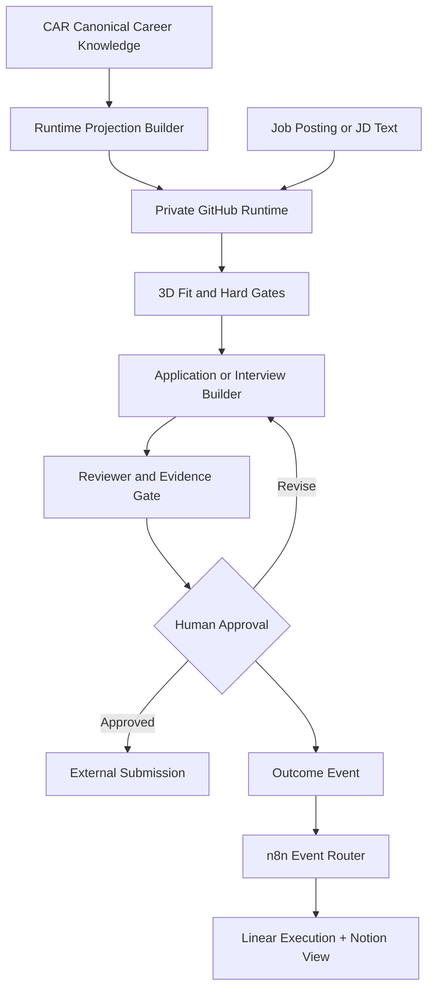
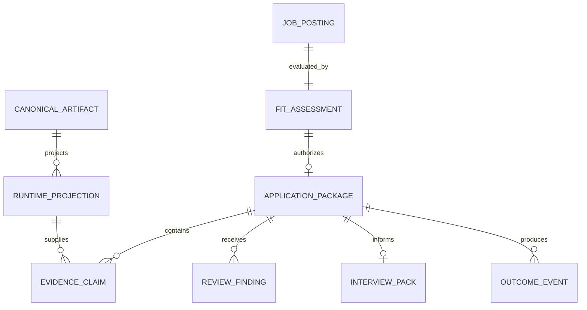
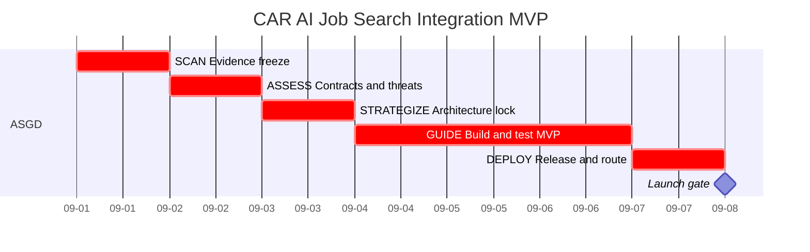
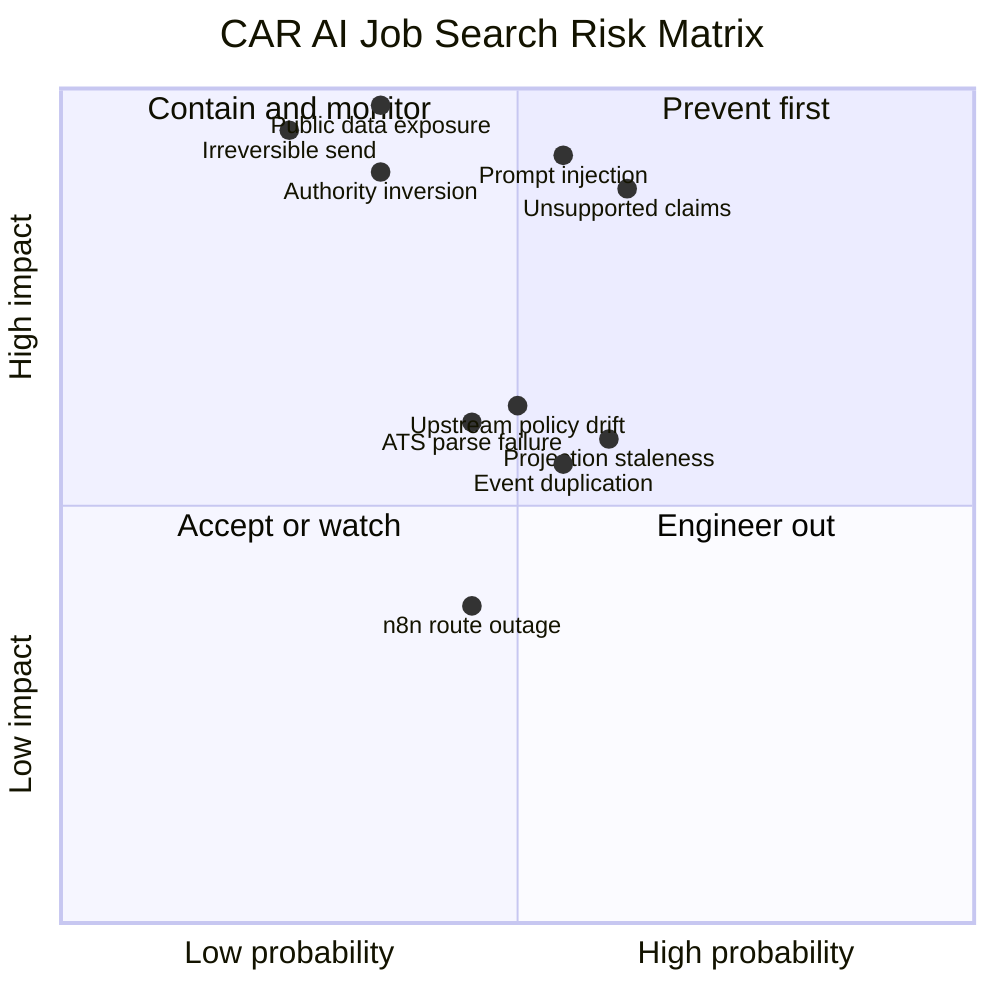
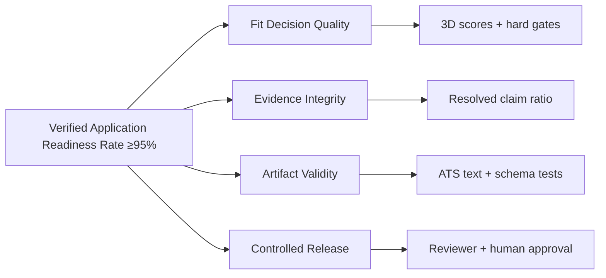
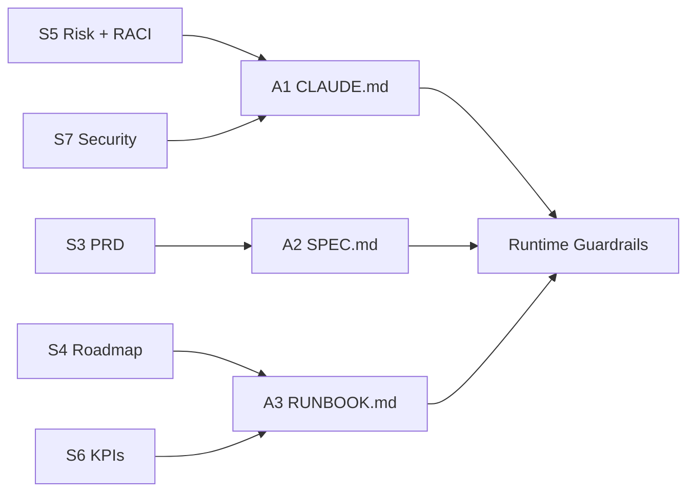

# CAR AI Job Search Integration Strategy

> Source of truth for what is being built, why it exists, who governs it, when it launches, and how launch success is proven.

## S1 Brief

<!-- chunk_id: CAR-AIJS-STRAT.S1.001 | title: Brief | summary: Defines the problem, hypothesis, scope, stakeholders, constraints, venture code, and launch target. | tags: [brief, scope, governance] | entities: [CAR, Claude Code, GitHub, n8n] | confidence: 98 -->

**Problem.** CAR already contains the career evidence and artifacts needed for high-quality job search assistance, but application execution is fragmented across AI sessions and lacks one reproducible, testable runtime. The audited upstream repository provides strong application, review, security, interview, and outcome patterns, but adopting its repository-owned candidate profile would create a second career source of truth.

**Hypothesis.** A private GitHub execution layer that receives a deterministic, minimum-necessary projection from CAR can preserve canonical career truth while adding Claude Code execution, evidence-safe generation, CI validation, interview continuity, and outcome feedback.

| Scope | Included | Why |
|---|---|---|
| **IN** | CAR runtime projection | Supplies verified career facts without copying canonical ownership |
| **IN** | Job-description URL or pasted-text intake | Enables role evaluation without mandatory scraping |
| **IN** | 3D fit assessment plus hard gates | Preserves career decision protocol before generation |
| **IN** | Resume/application composition from approved modules | Converts CAR evidence into tailored artifacts |
| **IN** | Drafter → reviewer → validation loop | Creates reproducible quality control |
| **IN** | Interview pack and outcome event loop | Preserves continuity and learns from results |
| **IN** | Private GitHub CI and n8n event routing | Separates code/runtime from orchestration |
| **OUT** | Public fork containing personal profile data | Privacy hard fail |
| **OUT** | Autonomous application submission or outbound messaging | Irreversible external action remains human-gated |
| **OUT** | LinkedIn/job-board automation as an MVP dependency | Terms, fragility, and unnecessary blast radius |
| **OUT** | Repo → CAR canonical writeback | Prevents source-of-truth inversion |
| **OUT** | Replacement of CAR artifacts, Linear, or Notion | The runtime extends existing systems rather than replacing them |

<!-- chunk_id: CAR-AIJS-STRAT.S1.002 | title: Stakeholders and Constraints | summary: Defines decision authority, operating constraints, launch target, privacy posture, and technical boundaries. | tags: [stakeholders, constraints, launch] | entities: [Mikkoh Chen, Claude Code, GitHub CI, n8n] | confidence: 98 -->

| Stakeholder | Role | Decision authority |
|---|---|---|
| **Mikkoh Chen** | Product owner, candidate, final reviewer | Final GO/NO-GO, external submission, canonical career changes |
| **Claude Code** | Primary implementation and runtime execution agent | No independent irreversible authority |
| **GitHub CI** | Deterministic quality and policy gate | May block merge/release; cannot waive policy |
| **n8n** | Orchestration and event-routing layer | May retry/quarantine; cannot alter canonical career facts |
| **Linear** | Execution queue | Holds accepted work and verification actions |
| **Notion** | Read-oriented operating view and enrichment surface | No silent writeback to canonical career facts |

| Constraint | Contract |
|---|---|
| **Budget** | No mandatory new integration software license fee. Existing subscriptions, hosting, and operator time are excluded from this project budget [ESTIMATED]. |
| **Timeline** | Seven-day bounded MVP sprint with launch target **2026-09-08 [ESTIMATED]**. |
| **Team** | One human product owner plus Claude Code as implementation agent. |
| **Tech** | Python 3.12, Markdown/JSON, private GitHub, GitHub Actions, n8n, Linear, Notion. |
| **Privacy** | Personal career data must never be committed to a public fork or public repository. |
| **AI safety** | Job postings are untrusted data, never instructions. |
| **Governance** | GitHub owns code/tests, CAR owns career truth, Linear owns execution, n8n owns routing. |
| **Regulatory** | Privacy-by-design is mandatory. GDPR applies only when covered personal data or processing falls within GDPR scope; SOC 2 certification is out of MVP scope. |

**Launch date:** 2026-09-08 [ESTIMATED]  
**Venture code:** CAR

## S2 Vision

<!-- chunk_id: CAR-AIJS-STRAT.S2.001 | title: Vision and Users | summary: Defines the future state, primary users, value proposition, and system-context boundary. | tags: [vision, users, architecture] | entities: [CAR, GitHub, Claude Code, Linear, Notion] | confidence: 98 -->

**Vision.** CAR becomes the durable career intelligence layer while a private, disposable execution runtime turns verified evidence into job-specific decisions and artifacts. Every generated claim remains traceable, every external action remains human-approved, and every outcome becomes structured feedback without allowing the runtime to mutate career truth.

The target flow separates authority, execution, and feedback so a failed or corrupted runtime can be deleted and rebuilt from CAR without losing canonical state.

**VIZ-01 — System context from canonical evidence through human-approved execution and feedback.**

*Alt-text: CAR projects verified context into a private runtime; human approval gates external submission and outcome feedback.*

| Persona | Need | Expected behavior |
|---|---|---|
| **Candidate operator** | Fast, high-confidence application and interview preparation | Reviews GO/NO-GO, approves claims, sends externally |
| **Claude Code executor** | Compact context, exact contracts, verifiable tests | Reads only needed projection, implements narrowly, runs gates |
| **Career strategy assistant** | Reliable career evidence and outcome history | Uses CAR evidence IDs, never invents missing proof |
| **Workflow operator** | Visible failures, retries, and idempotent events | Uses n8n quarantine/retry without changing source authority |

**Value proposition.** The system converts CAR from a knowledge library into an execution-grade career operating system without introducing a competing career database. The key improvement is not more automation. It is **more automation inside a stricter evidence and authority boundary**.

<!-- chunk_id: CAR-AIJS-STRAT.S2.002 | title: Competitive Position and Done Definition | summary: Compares implementation alternatives and defines launch completion. | tags: [competition, done, decision] | entities: [AI Job Search, CAR] | confidence: 97 -->

| Alternative | Strength | Material gap versus target |
|---|---|---|
| **MadsLorentzen/ai-job-search** | Mature Claude Code workflow, strong CI/security, interview/outcome depth | Repository-owned profile conflicts with CAR authority; portal defaults are not the target sourcing model |
| **Manual CAR + ad hoc AI chats** | Strong career context and human control | Low reproducibility, session drift, weak automated QA |
| **Generic auto-apply tools** | High application volume | Weak evidence provenance, brand risk, opaque tailoring, irreversible automation |
| **ATS resume optimizers** | Keyword and parseability assistance | Narrow artifact scope; no end-to-end decision, interview, or outcome loop |
| **Target CAR runtime** | Canonical evidence + deterministic gates + agent execution | Higher initial setup than ad hoc prompting |

### Definition of Done at Launch

| ID | Launch condition |
|---|---|
| DOD-01 | A private repository passes visibility and permission preflight. |
| DOD-02 | The same CAR input produces the same normalized runtime projection and checksum. |
| DOD-03 | A JD can be normalized from pasted text and URL-fetched text without executing instructions embedded in it. |
| DOD-04 | Every evaluation emits Job-Fit Match, Requirements Reality, Strategic Value, hard-gate results, and evidence confidence. |
| DOD-05 | Every factual candidate claim in generated output resolves to a CAR evidence ID or is explicitly rejected. |
| DOD-06 | Golden application outputs pass text-layer/ATS readability checks and reviewer gates. |
| DOD-07 | Outcome events replay idempotently and route to the execution queue without duplicates. |
| DOD-08 | No external application, email, message, canonical data mutation, or destructive Git action occurs without explicit human approval. |

## S3 PRD

<!-- chunk_id: CAR-AIJS-STRAT.S3.001 | title: Product Requirements | summary: Defines prioritized product features, user stories, acceptance conditions, edge cases, dependencies, and phases. | tags: [prd, features, mvp] | entities: [Runtime Projection, Fit Assessment, Evidence Claim] | confidence: 98 -->

| Feature | Description | Priority | User story | Acceptance | Edge cases | Dependencies | Phase |
|---|---|---:|---|---|---|---|---|
| **Runtime Projection** | Deterministic minimum-necessary CAR context package | P0 | As an agent, I need verified facts without full-vault loading | Same source yields same normalized hash | Missing artifact, duplicate IDs, stale export | Schema, CAR export | GUIDE |
| **JD Intake** | Normalize pasted text or approved fetched posting | P0 | As a candidate, I need one normalized role record | Required fields or explicit nulls | Dead URL, malformed HTML, missing salary | Schema | GUIDE |
| **Hard Gates** | Company size, work mode, healthcare, eligibility, language, other configured vetoes | P0 | As a candidate, I need automatic rejection before wasted work | Gate verdict includes source and reason | Silent posting, ambiguous wording | JD Intake, preferences | GUIDE |
| **3D Fit Engine** | Job-Fit, Requirements Reality, Strategic Value | P0 | As a candidate, I need one ACT/PASS/CONSIDER decision | ≥70% minimum to proceed plus explicit sub-scores | Missing requirement evidence | Projection, JD | GUIDE |
| **Evidence Resolver** | Resolve claims to career evidence IDs | P0 | As a reviewer, I need zero unsupported claims | Unsupported factual candidate claim count = 0 | Conflicting metrics, weak confidence | Projection | GUIDE |

<!-- chunk_id: CAR-AIJS-STRAT.S3.006 | title: Product Requirements Continuation | summary: Completes the delivery features for application generation, validation, approval, interview continuity, outcome events, and orchestration. | tags: [prd, features, delivery] | entities: [ApplicationPackage, InterviewPack, OutcomeEvent, n8n] | confidence: 98 -->

| Feature | Description | Priority | User story | Acceptance | Edge cases | Dependencies | Phase |
|---|---|---:|---|---|---|---|---|
| **Application Builder** | Compose tailored resume/copy from approved modules | P0 | As a candidate, I need fast role-specific materials | Only evidence-resolved candidate claims | Overfitting, keyword stuffing | Fit, evidence | GUIDE |
| **Reviewer + Validators** | Independent review, contract lint, ATS text check | P0 | As a candidate, I need a release gate before use | All hard validators pass | Reviewer disagreement, PDF failure | Builder | GUIDE |
| **Human Approval Gate** | Explicit approval before irreversible action | P0 | As owner, I retain final authority | No send/mutate path without approval token | Stale approval, changed artifact | Review | DEPLOY |
| **Interview Pack** | Stage-specific prep from exact submitted materials and STARs | P1 | As a candidate, I need continuity by interview stage | Answers resolve to evidence or gap language | Missing submitted copy | Projection, archive | DEPLOY |
| **Outcome Event Loop** | Structured, idempotent status and learning events | P0 | As operator, I need feedback without duplicate writes | Replay produces zero duplicates | Conflicting status, late event | Event schema | DEPLOY |
| **n8n Router** | Route approved events to Linear and Notion views | P1 | As operator, I need deterministic cross-system updates | Retry/quarantine and idempotency key enforced | Timeout, partial write | Outcome Event | DEPLOY |

<!-- chunk_id: CAR-AIJS-STRAT.S3.003 | title: MVP Scope | summary: Orders the P0 capabilities required to prove source authority, decision quality, evidence integrity, release validation, approval, and outcome learning. | tags: [mvp, p0, build-order] | entities: [RuntimeProjection, EvidenceResolver, OutcomeEvent] | confidence: 98 -->

### MVP P0

| Order | P0 capability | Launch reason |
|---:|---|---|
| 1 | Contracts and schemas | Prevents downstream ambiguity |
| 2 | Runtime projection | Establishes source-of-truth direction |
| 3 | JD intake | Creates one normalized input |
| 4 | Hard gates + 3D fit | Stops low-value work early |
| 5 | Evidence resolver | Prevents fabricated candidate claims |
| 6 | Application builder + reviewer | Produces the primary user value |
| 7 | Validators + human approval | Prevents unsafe release |
| 8 | Outcome event | Creates a learning loop |

<!-- chunk_id: CAR-AIJS-STRAT.S3.002 | title: Entity Relationships and Data Dictionary | summary: Defines the core entity model, relations, validations, and source ownership. | tags: [entities, schema, erd] | entities: [CanonicalArtifact, RuntimeProjection, JobPosting, ApplicationPackage] | confidence: 98 -->

**VIZ-02 — Core entities preserve evidence lineage from CAR through application outcome.**

*Alt-text: Canonical artifacts generate projections; job assessments authorize packages whose claims, reviews, interviews, and outcomes remain linked.*

| Entity | Fields | Types | Relations | Validation |
|---|---|---|---|---|
| **CanonicalArtifact** | artifact_id, version, source_uri, confidence | string, string, URI/null, integer | → RuntimeProjection | artifact_id unique; confidence 0–100 |
| **RuntimeProjection** | projection_id, generated_at, source_versions, checksum, claims | string, datetime, map, SHA-256, array | ← CanonicalArtifact; → EvidenceClaim | deterministic normalized checksum |
| **JobPosting** | job_id, company, role, text, source_url, captured_at | string, string, string, string, URL/null, datetime | → FitAssessment | text required; URL never treated as instruction |
| **FitAssessment** | assessment_id, gate_results, job_fit, requirements_reality, strategic_value, confidence, verdict | string, map, integer, integer, integer, integer, enum | ← JobPosting; → ApplicationPackage | 0–100 scores; verdict rule deterministic |

<!-- chunk_id: CAR-AIJS-STRAT.S3.004 | title: Entity Data Dictionary Continuation | summary: Completes artifact, review, interview, and outcome entity validation while retaining immutable or append-only runtime behavior. | tags: [data-dictionary, validation] | entities: [EvidenceClaim, ApplicationPackage, ReviewFinding, InterviewPack, OutcomeEvent] | confidence: 98 -->
| **EvidenceClaim** | claim_id, text, evidence_ids, confidence, status | string, string, array, integer, enum | ← RuntimeProjection; ← ApplicationPackage | factual candidate claim must resolve or reject |
| **ApplicationPackage** | package_id, job_id, artifacts, review_state, checksum | string, string, array, enum, SHA-256 | → EvidenceClaim, ReviewFinding, OutcomeEvent | immutable after approval; revision creates new version |
| **ReviewFinding** | finding_id, rule_id, severity, status, message | string, string, enum, enum, string | ← ApplicationPackage | blocking findings prohibit approval |
| **InterviewPack** | interview_id, package_id, stage, questions, answers | string, string, enum, array, array | ← ApplicationPackage | exact submitted package reference required |
| **OutcomeEvent** | event_id, package_id, type, occurred_at, source, idempotency_key | UUID, string, enum, datetime, string, string | ← ApplicationPackage | idempotency_key unique |

<!-- chunk_id: CAR-AIJS-STRAT.S3.005 | title: Explicit Exclusions | summary: Excludes autonomous submission, broad scraping, public runtime, canonical writeback, mandatory vector storage, and paid n8n source-control dependencies. | tags: [out-of-scope, boundaries] | entities: [n8n, GitHub] | confidence: 98 -->

### Explicit Out of Scope

| Item | Why |
|---|---|
| Mass auto-apply | Volume conflicts with evidence and brand-control goals |
| Autonomous send/email/DM | Irreversible external action requires human approval |
| Broad job-board scraping | Not required to prove the execution architecture |
| Public runtime fork | Public forks inherit public visibility from the upstream network [W 2026-09-01] |
| Runtime edits to CAR career facts | Violates authority boundary |
| Mandatory vector database | Exact IDs, metadata, lexical search, and scoped projection are sufficient for MVP |
| n8n built-in Git environments | Official source-control environments are Business/Enterprise features, so MVP cannot depend on them [W 2026-09-01] |

## S4 Roadmap

<!-- chunk_id: CAR-AIJS-STRAT.S4.001 | title: ASGD Roadmap | summary: Converts ASGD into a gated seven-day implementation sequence with owners, deliverables, and critical path. | tags: [roadmap, asgd, launch] | entities: [SCAN, ASSESS, STRATEGIZE, GUIDE, DEPLOY] | confidence: 96 -->

**VIZ-03 — ASGD phases gate the critical path from evidence freeze to controlled launch.**

*Alt-text: Five sequential ASGD gates form the critical path, with build/testing consuming the largest implementation block.*

| Phase | Deliverables | GO/NO-GO gate | Owner | Duration |
|---|---|---|---|---:|
| **SCAN** | Source manifest, pinned upstream commit, CAR artifact map | No unresolved source-authority conflict | Mikkoh + Claude Code | 1 day |
| **ASSESS** | Schemas, threat model, risk register, golden fixtures | All P0 contracts explicit | Claude Code | 1 day |
| **STRATEGIZE** | Module graph, build order, exact CLI/test contract | Architecture has one authority per data class | Mikkoh | 1 day |
| **GUIDE** | P0 modules, tests, CI, adversarial fixtures | All P0 tests and hard gates pass | Claude Code + GitHub CI | 3 days |
| **DEPLOY** | Private release, n8n event route, rollback checkpoint | Human approval test + idempotent event test pass | Mikkoh | 1 day |

**Critical path:** source freeze → contracts → projection → JD intake → fit → evidence → application → review/validate → approval → outcome event → launch.

<!-- chunk_id: CAR-AIJS-STRAT.S4.002 | title: Launch Checklist | summary: Defines pre-launch, launch-day, and post-launch execution tasks with MoSCoW priorities and dependencies. | tags: [checklist, launch, operations] | entities: [GitHub, n8n, Linear] | confidence: 97 -->

| Task | Stage | MoSCoW | Owner | Dependency | Status | Due |
|---|---|---|---|---|---|---|
| Pin upstream reference and source registry | Pre-launch | Must | Claude Code | None | Not started | 2026-09-01 |
| Create private repository and visibility preflight | Pre-launch | Must | Mikkoh | None | Not started | 2026-09-01 |
| Commit schemas before implementation | Pre-launch | Must | Claude Code | Source registry | Not started | 2026-09-02 |
| Build deterministic CAR projection | Pre-launch | Must | Claude Code | Schemas | Not started | 2026-09-03 |
| Add untrusted-posting adversarial fixtures | Pre-launch | Must | Claude Code | JD schema | Not started | 2026-09-04 |
| Implement 3D fit + evidence resolver | Pre-launch | Must | Claude Code | Projection + intake | Not started | 2026-09-05 |
| Implement builder/reviewer/ATS gates | Pre-launch | Must | Claude Code | Fit + evidence | Not started | 2026-09-06 |
<!-- chunk_id: CAR-AIJS-STRAT.S4.003 | title: Launch and Post-Launch Checklist | summary: Governs launch-day dry runs, approval, replay, n8n routing, interview extension, and first-week review. | tags: [launch-day, post-launch] | entities: [GitHub CI, n8n, Linear] | confidence: 97 -->

| Run full CI and golden fixture suite | Launch-day | Must | GitHub CI | P0 complete | Not started | 2026-09-07 |
| Verify GitHub Actions least permissions + SHA pins | Launch-day | Must | Mikkoh | CI workflow | Not started | 2026-09-07 |
| Execute one dry-run application with no external send | Launch-day | Must | Mikkoh | CI green | Not started | 2026-09-08 |
| Approve or reject first package manually | Launch-day | Must | Mikkoh | Dry run | Not started | 2026-09-08 |
| Emit and replay one outcome event twice | Launch-day | Must | Claude Code | Approved package | Not started | 2026-09-08 |
| Route event through n8n to Linear test target | Post-launch | Should | Mikkoh | Event replay | Not started | 2026-09-09 |
| Add interview-pack module | Post-launch | Should | Claude Code | Application archive | Not started | 2026-09-10 |
| Review first-week failures and update thresholds | Post-launch | Should | Mikkoh | Production use | Not started | 2026-09-15 |

## S5 Risk + RACI

<!-- chunk_id: CAR-AIJS-STRAT.S5.001 | title: Risk Register | summary: Prioritizes privacy, evidence, prompt-injection, authority, and integration failures with explicit mitigations and owners. | tags: [risk, security, governance] | entities: [GitHub, Claude Code, n8n] | confidence: 98 -->

**VIZ-04 — Risk matrix emphasizes privacy, prompt injection, unsupported claims, and authority inversion.**

*Alt-text: High-impact risks cluster around privacy, prompt injection, unsupported claims, authority inversion, and irreversible external actions.*

<!-- chunk_id: CAR-AIJS-STRAT.S5.003 | title: Risk Treatments | summary: Converts the matrix into owned mitigations for privacy, prompt injection, evidence, governance, external action, state, supply chain, ATS, routing, and freshness failures. | tags: [risk-treatment, mitigation] | entities: [GitHub CI, Claude Code, n8n] | confidence: 98 -->

| ID | Category | Probability | Impact | Irreversible? | Mitigation | Owner | Status |
|---|---|---|---|---|---|---|---|
| R-01 | Privacy | M | H | **Yes** | Private repo preflight; secret/personal-data guard | Mikkoh | Open |
| R-02 | Prompt injection | M | H | Potentially | Treat JD as data; deny body-directed fetch/tool/file actions | Claude Code | Open |
| R-03 | Evidence | M | H | Yes after send | Claim resolver + blocking unsupported-claim test | GitHub CI | Open |
| R-04 | Governance | L | H | Potentially | CAR remains read-only authority; projection directionality test | Mikkoh | Open |
| R-05 | External action | L | H | **Yes** | Approval token required for send/mutation boundary | Mikkoh | Open |
| R-06 | State | M | M | No | UUID/idempotency key; replay tests | Claude Code | Open |
| R-07 | Supply chain | M | M | Potentially | Full-SHA GitHub Action pins; least token permissions | GitHub CI | Open |
| R-08 | ATS | M | M | No | Text extraction and minimum-content checks | Claude Code | Open |
| R-09 | Orchestration | M | L | No | n8n retries, error route, quarantine | n8n | Open |
| R-10 | Freshness | M | M | No | Projection source-version manifest and TTL warning | Claude Code | Open |

<!-- chunk_id: CAR-AIJS-STRAT.S5.002 | title: RACI | summary: Assigns accountability for architecture, code, security, launch, and data-governance deliverables. | tags: [raci, ownership] | entities: [Mikkoh Chen, Claude Code, GitHub CI, n8n] | confidence: 98 -->

| Deliverable | Mikkoh | Claude Code | GitHub CI | n8n |
|---|---|---|---|---|
| Strategy / architecture lock | **A/R** | C | I | I |
| Contract schemas | A | **R** | C | I |
| Projection builder | A | **R** | C | I |
| 3D fit + evidence resolver | **A** | R | C | I |
| Application/reviewer runtime | A | **R** | C | I |
| Security guard policy | **A** | R | **C** | I |
| Merge/release quality gate | A | R | **R** | I |
| External submission | **A/R** | C | I | I |
| Outcome event routing | A | C | I | **R** |
| Canonical career change | **A/R** | C | I | I |

## S6 KPIs

<!-- chunk_id: CAR-AIJS-STRAT.S6.001 | title: KPI System | summary: Defines the north-star quality rate, phase metrics, targets, measurement methods, cadence, and lead-lag status. | tags: [kpi, quality, launch] | entities: [VARR, CAR] | confidence: 97 -->

**North star:** **Verified Application Readiness Rate (VARR)** = application packages passing fit, evidence, ATS/readability, reviewer, and approval gates before submission ÷ all generated application packages. Launch target **≥95%**.

**VIZ-05 — North-star quality is driven by fit, evidence, artifact validity, and controlled release inputs.**

*Alt-text: Readiness depends on fit, evidence, artifact validity, and controlled release, each with a measurable input.*

<!-- chunk_id: CAR-AIJS-STRAT.S6.002 | title: Phase Metrics | summary: Defines measurable phase-level lead and lag indicators with explicit unknown baselines and nonfabricated targets. | tags: [metrics, measurement] | entities: [VARR, GitHub CI] | confidence: 97 -->

| Phase | Metric | Baseline | Target | Method | Cadence | Lead/Lag |
|---|---|---:|---:|---|---|---|
| SCAN | Source provenance coverage | [UNVERIFIED] | 100% P0 sources | Manifest audit | Once + change | Lead |
| ASSESS | Contract completeness | [UNVERIFIED] | 100% P0 fields typed | Schema lint | Per PR | Lead |
| STRATEGIZE | Authority conflicts | [UNVERIFIED] | 0 unresolved | Architecture test | Per release | Lead |
| GUIDE | Projection determinism | [UNVERIFIED] | 100% repeatable checksum | Golden fixture | Per PR | Lead |
| GUIDE | Unsupported candidate claims | [UNVERIFIED] | 0 blocking claims | Claim resolver test | Every package | Lead |
| GUIDE | ATS-readable outputs | [UNVERIFIED] | 100% golden outputs | Text extraction | Per PR | Lead |
| DEPLOY | Outcome replay duplicates | [UNVERIFIED] | 0 | Replay same event twice | Per release | Lead |
| DEPLOY | VARR | [UNVERIFIED] | ≥95% | Package gate ledger | Weekly | Lag |
| POST | Qualified response rate | [UNVERIFIED] | Track, no fabricated target | Pipeline outcomes | Weekly | Lag |

<!-- chunk_id: CAR-AIJS-STRAT.S6.003 | title: Health Signals | summary: Defines five operational signals that stop unsafe or low-integrity execution before they become application or data-quality incidents. | tags: [health, stop-signals] | entities: [CAR, GitHub CI] | confidence: 98 -->

### Health Signals

These signals are stop conditions, not vanity metrics. A red signal blocks the next irreversible boundary until the underlying defect is resolved and regression-tested.

| Signal | Healthy | Action when unhealthy |
|---|---|---|
| Unsupported factual candidate claims | **0** | Block package and require evidence resolution |
| Projection checksum drift from identical source | **0** | Halt build; inspect normalization |
| Irreversible action without approval | **0** | Disable release path; incident review |
| Duplicate outcome events on replay | **0** | Quarantine integration event |
| P0 CI gate pass rate | **≥95% rolling** | Stop feature work until regression fixed |

## S7 Security

<!-- chunk_id: CAR-AIJS-STRAT.S7.001 | title: Security Architecture | summary: Defines data classes, access controls, encryption, logging, dependency controls, and incident response boundaries. | tags: [security, privacy, access-control] | entities: [GitHub Actions, Claude Code, n8n] | confidence: 98 -->

| Data class | Examples | Storage rule | Access rule | Log rule |
|---|---|---|---|---|
| **Public** | Public JD, public company pages | Cache allowed | Read-only | Source URL + capture time |
| **Internal** | Workflow specs, test fixtures | Private repo | Repo collaborators | Commit/PR audit |
| **Confidential personal** | Resume content, salary constraints, contact data | CAR authority + minimum runtime projection | Need-to-know | Never log raw secrets/contact data |
| **Evidence-restricted** | Unverified metric, private proof | Canonical evidence store | Explicitly admitted fields only | Log evidence ID, not unnecessary content |
| **Secret** | Tokens, API keys, credentials | Secret manager/environment | Never committed | Log reference/name only |

| Control | Required implementation | WHY |
|---|---|---|
| Repository visibility | Private repository; fail closed if public | GitHub states public-repository forks are public [W 2026-09-01] |
| Claude context | Minimum-necessary projection; JD isolated as untrusted data | Reduces prompt-injection and data-exfiltration surface |
| GitHub Actions | `permissions: contents: read` by default; elevate per job only | Limits compromised-workflow blast radius |
| Action supply chain | Pin third-party Actions to full commit SHA | GitHub documents full SHA as the immutable-reference option [W 2026-09-01] |
| Hooks | Default-deny automatic agent hooks | Hooks run without an action-specific human decision |
| Dependencies | Lock versions; forbid install lifecycle surprises where feasible | Reduces supply-chain execution risk |
| Encryption in transit | HTTPS/TLS for APIs; SSH/HTTPS for Git | Prevents cleartext transport |
| Encryption at rest | Rely on approved platform storage plus host-disk protection | Career data is personal/confidential |
| Audit logging | Commit, PR, release, event ID, source versions, reviewer verdict | Makes every generated/submitted package attributable |
| n8n workflow versioning | Version exported workflow JSON in Git; do not require n8n native environments | Native n8n source-control environments are Business/Enterprise [W 2026-09-01] |

<!-- chunk_id: CAR-AIJS-STRAT.S7.002 | title: Incident and Regulatory Scope | summary: Defines security incident response, data handling, and explicit compliance boundaries for the MVP. | tags: [incident-response, regulatory] | entities: [GDPR, GitHub] | confidence: 96 -->

### Incident Response

| Stage | Trigger | Action | Recovery gate |
|---|---|---|---|
| **Detect** | Secret leak, public-data exposure, prompt-injection behavior, unauthorized send | Stop runtime and preserve evidence | Incident ID created |
| **Contain** | Confirmed exposure or unsafe tool path | Revoke tokens, disable workflow, block merge | Access path closed |
| **Eradicate** | Root cause identified | Patch policy/code and add regression fixture | Test fails before fix and passes after |
| **Recover** | Clean private runtime available | Rebuild projection from CAR, rotate affected secrets | Full CI green |
| **Review** | Service restored | Record blast radius, decisions, follow-up tasks | Owner accepts closure |

| Regulatory area | MVP position |
|---|---|
| **GDPR** | Conditional. Apply data minimization, lawful processing, access limitation, and deletion obligations when GDPR-covered data/processing is in scope. |
| **CCPA/CPRA** | Conditional. Personal data should remain minimized and purpose-bound where applicable. |
| **SOC 2** | Certification is out of scope. Controls borrow least-privilege, logging, change-management, and incident-response practices. |
| **Employment/ATS claims** | System must not fabricate work history, qualifications, metrics, authorization, or credentials. |
| **Job-board terms** | Automated portal access is not an MVP dependency; each future adapter requires separate terms/access review. |

## Appendix A — Traceability

<!-- chunk_id: CAR-AIJS-STRAT.APP.001 | title: Traceability Map | summary: Maps product requirements and governance sections directly into the three implementation artifacts in the execution pack. | tags: [traceability, requirements] | entities: [SPEC.md, RUNBOOK.md, CLAUDE.md] | confidence: 99 -->

**VIZ-08 — Strategy requirements trace directly into implementation, execution, and governance artifacts.**

*Alt-text: PRD maps to SPEC, roadmap and KPIs to RUNBOOK, and risk/security to CLAUDE, converging on runtime guardrails.*

| Requirement source | Implementation destination | Trace rule |
|---|---|---|
| S3 PRD | A2 SPEC.md | Every P0 feature maps to one self-contained module contract |
| S4 Roadmap | A3 RUNBOOK.md | Every ASGD phase has prompt, gate, rollback, and tests |
| S5 Risk + RACI | A1 CLAUDE.md | Irreversible and high-severity risks become runtime prohibitions |
| S6 KPIs | A3 RUNBOOK.md | Phase completion requires measurable pass bars |
| S7 Security | A1 CLAUDE.md | Access, supply-chain, data, and approval rules are always-loaded context |

## Appendix B — Evidence Registry

<!-- chunk_id: CAR-AIJS-STRAT.APP.002 | title: Evidence Registry | summary: Records the project, upstream, and official documentation used to validate the strategy. | tags: [evidence, sources] | entities: [GitHub, Anthropic, n8n, CAR] | confidence: 98 -->

| Source | Evidence used | State |
|---|---|---|
| **GitHub Repository Analyzer v7.0 — AI Job Search Audit, 2026-09-01** | Selective integration score, target authority model, risk register, acceptance gates | [K] |
| **CAR Master Artifacts Library / Artifact Forge OS** | Master Structured Career Graph, Resume Library, STAR/metrics/evidence architecture | [K] |
| **MadsLorentzen/ai-job-search @ `4c38f7ce...`** | Application/reviewer pattern, security guards, CI, interview/outcome workflow | [W 2026-09-01] |
| **GitHub Docs — Forks** | Public repository forks remain public | [W 2026-09-01] |
| **GitHub Docs — Secure use reference** | Full-SHA action pinning and least-permission guidance | [W 2026-09-01] |
| **Anthropic Prompting Best Practices** | Long-horizon state, fresh-session recovery, tests, filesystem/git state | [W 2026-09-01] |
| **n8n Docs — Source control environments** | Native environments/source control availability and one-direction workflow guidance | [W 2026-09-01] |
| **n8n Docs — Executions** | Failed-execution review and retry behavior | [W 2026-09-01] |

### Release Confidence

| Dimension | Score |
|---|---:|
| Accuracy | 97% |
| Completeness | 96% |
| Relevance | 99% |
| Impact alignment | 97% |
| **Composite release confidence** | **97.25% — RELEASE** |

**Open items.** The exact CAR export interface, existing n8n instance topology, and final repository name are implementation-time choices, not blockers. The execution pack therefore defines stable contracts without fabricating those environment-specific values.
